# Store Manager (API de Gerenciamento de Loja / Store Management API)

<p>
  

  
  
  
    
  
</p>
<br />

<p>
O projeto Store Manager representa a parcela backend de um gerenciador de loja. Esse projeto foi desenvolvido para fins de estudo e tinha foco em solidificar o conhecimento backend utilizando o paradigma funcional, banco de dados relacionais utilizando o MySQL e testes.
</p>

---

<p>
The Store Manager project represents the backend portion of a store management system. This project was developed for study purposes and aimed to solidify backend knowledge using the functional paradigm, relational databases using MySQL, and testing.
</p>
<br />

### Rotas / Routes
No Navegador / On Browser ("http://localhost:3000/api-docs"): <br><br>
<b>
GET  /api-docs
</b>
<br />
<br />

------------------------
<p>Qualquer / Any:</p>

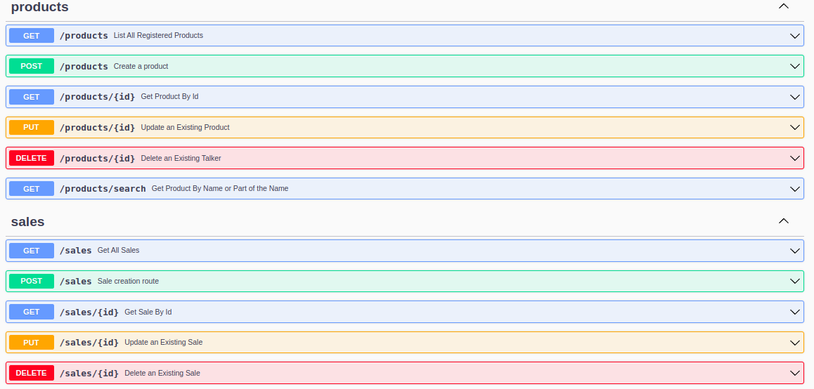

<br />


### :dart: Objetivos / Goals
- :white_check_mark: **Desenvolver o backend de um gerenciador de loja / Develope the backend for a store management system;**
- :white_check_mark: Desenvolvimento utilizando o paradigma funcional / Develop using functional paradigm;
- :white_check_mark: Desenvolver utilizando a arquitetura MSC(Model-Service-Controller) / Develop using the MVC (Model-Service-Controller) architecture;
- :white_check_mark: Implementar banco de dados / Database implementation;
- :white_check_mark: Desenvolver rotas de vendas e produtos / Develop sales and products routes
- :white_check_mark: Documentar aplicação / Document application
- :white_check_mark: Reforçar segurança com práticas como Helmet e Rate-Limit / Enhance security through practices such as Helmet and Rate-Limit;
- :white_check_mark: Cobrir no mínimo 100% por testes / Cover at least 100% with tests;
- :white_check_mark: Configurar Docker para execução do software / Configure Docker for software execution.<br><br>

### :computer: Tecnologias Utilizadas / Used Technologies
  * 
  * 
  * 
  * 
  * 
  * 
  * 
  * Chai
  * Sinon
  * Nyc
  * .env
  * Helmet
  * Rescue
  * Rate-Limit<br><br>

### :gear: Como Rodar / How to Run
  #### 1 Clone o repositório (via SSH) / Clone the repository (via SSH)
  No terminal / On terminal:
  
    git clone git@github.com:IgorMarinhoArgollo/store-manager.git
  
  <br/>

  #### 2 Opções para rodar(escolher 2.1 ou 2.2) / Options to run(choose between option 2.1 and 2.2)
  ##### 2.1 Rodando Localmente / Running Locally
  ###### Requerimentos / Requirements:
   * node.js
   * MySQL
  
  ###### Instalando as dependências / Installing dependencies:
  No terminal / On terminal:
  
    npm install

  ###### Criando .env na pasta / Creating .env file on the root of the project
  Crie o arquivo .env na pasta raiz contendo as seguintes chaves (vide exemplo a seguir) / Create the .env file in the root folder containing the following keys (see the example below):
  ```yaml
    # Nome do host do MySQL / MySQL host's name
    MYSQL_HOST=localhost
    # Usuário MySQL Local / Local MySQL User
    MYSQL_USER=root
    # Senha MySQL local / Local MySQL Password
    MYSQL_PASSWORD=12345678
    # Nome do DB / DB's Name
    MYSQL_DATABASE=StoreManager
    # Porta da aplicação / Application port
    PORT=3000

    
    # Dispensável, caso rodando localmente / Not needed for running locally
    DB_PORT=3308
  ``` 

  ###### Inicializando / Starting
  No terminal / On terminal:
  ``` Bash
    # cria o DB / create DB
    npm run migration
    # popula o DB / populate DB
    npm run seed
    # inicia a aplicação / start application
    npm run dev
  ```

  <br />
  
  ##### 2.2 Rodando no Container / Running on Container
  ###### Requisitos / Requirements:
   * Docker
   * Docker-compose

  ###### Criando .env na pasta / Creating .env file on the root of the project
  Crie o arquivo .env na pasta raiz contendo as seguintes chaves (vide exemplo a seguir) / Create the .env file in the root folder containing the following keys (see the example below):
  ```yaml
    # Nome do container / Container's name
    MYSQL_HOST=db
    # Usuário padrão durante a criação do container do DB / Default user for DB creation on container
    MYSQL_USER=admin
    # Qualquer valor (apenas para o mysql não acusar warning) / Any value (only for mysql not pointing warning)
    MYSQL_PASSWORD=123
    # Nome do DB / DB's Name
    MYSQL_DATABASE=StoreManager
    # Porta da aplicação / Application port
    PORT=3000
    # Porta do Container do DB / DB Container's Port
    DB_PORT=3308
  ```
  
  ###### Inicializando / Starting
  No terminal / On terminal:
  
    docker-compose up

<b>
Quando o terminal exibir a mensagem abaixo, os contêineres estarão prontos, e a aplicação poderá ser testada. / When the terminal shows the message below, the containers are ready, and the application can be tested.
</b>
<br>
<br>
<br/>

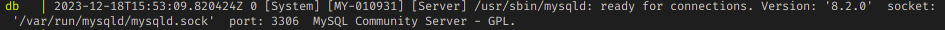
<br>
<br />


### :test_tube:	Testes / Tests

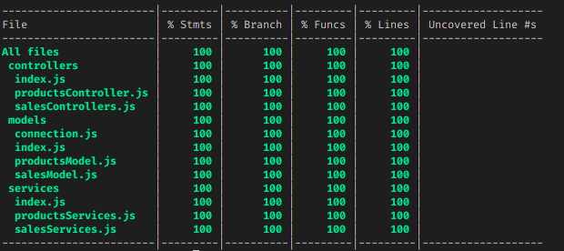


### Imagens / Images
#### PRODUCTS
- /products (GET)
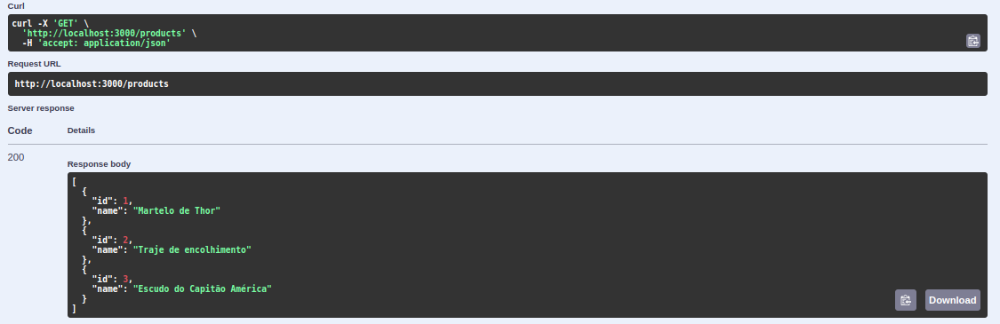
<br />

- /products/{id} (GET)
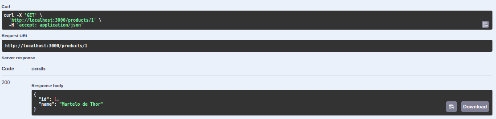
<br />

- /products (POST)
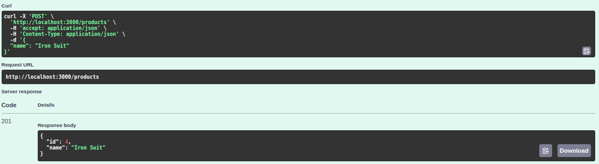
<br />

- /products/search?q= (GET)
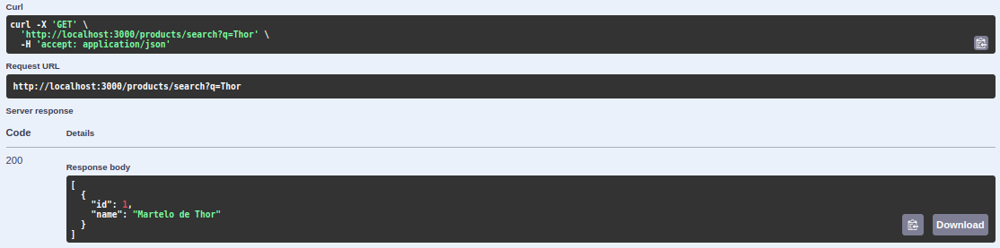
<br />

- /products/{id} (PUT)
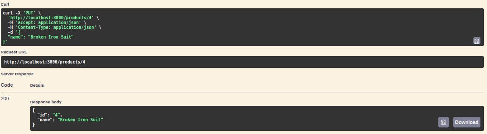
<br />

- /products/{id} (DELETE)
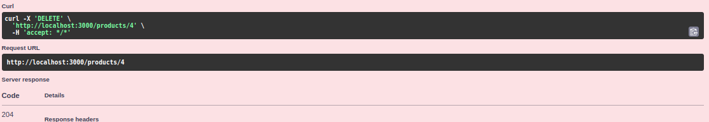
<br />
<br />

#### SALES
- /sales (GET)
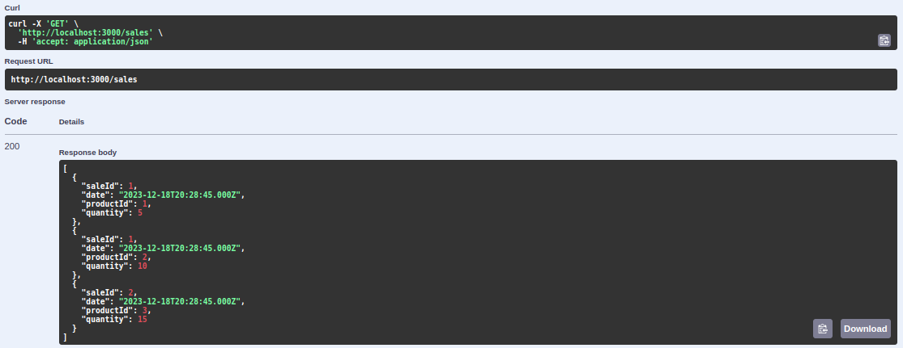
<br />

- /sales/{id} (GET)
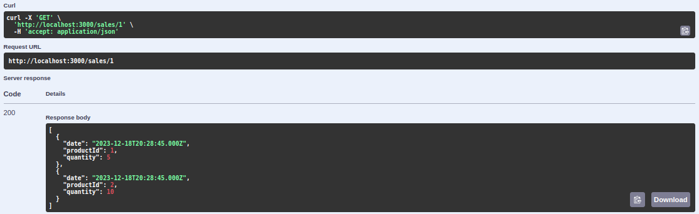
<br />

- /sales (POST)
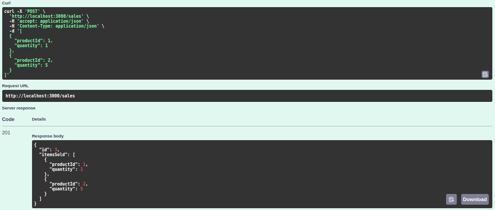
<br />

- /sales/{id} (PUT)
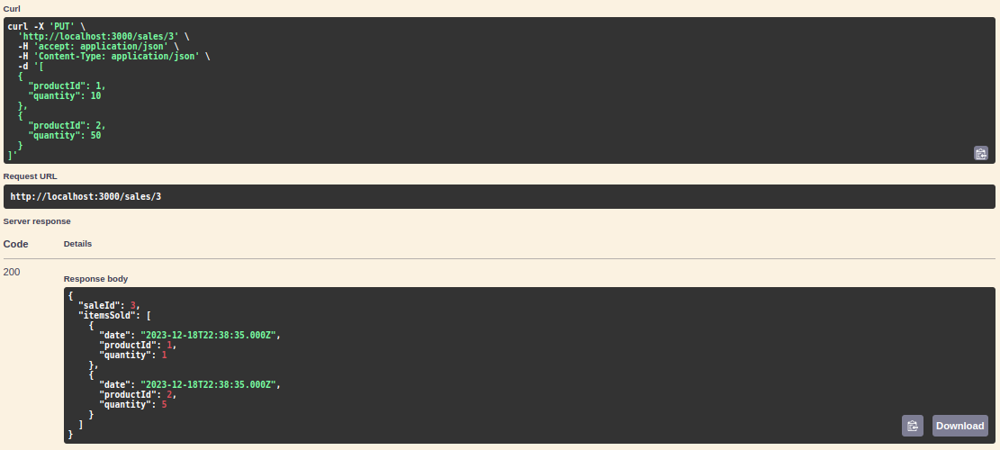
<br />

- /sales/{id} (DELETE)
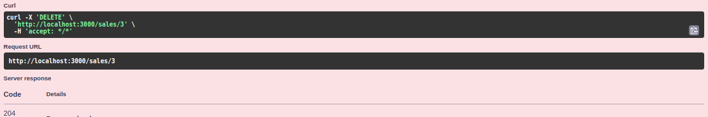
<br />
<br />


### :technologist: Author / Autor
<a href="https://www.linkedin.com/in/igormarinhoargollo/">
 
 <br />
 <sub><b>Igor Marinho Argollo</b></sub></a> <a href="https://www.linkedin.com/in/igormarinhoargollo/"></a>
 <br /> <br />

 
  ### :page_facing_up: Licença / License
  <br><br>
  

  